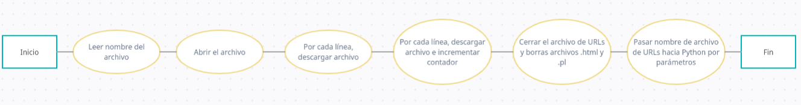
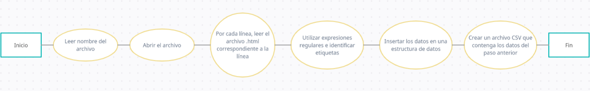
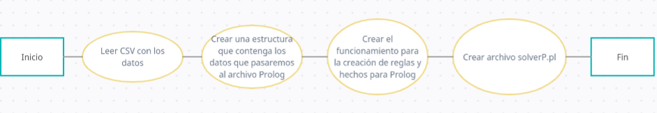
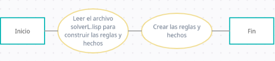

# <center>DOCUMENTACIÓN</center>

```
autor: Junior Castillo - jicastilloh@unah.hn
version: 0.0.4
```

# PRIMER AVANCE

## Análisis del Proyecto
Después de leer los requerimientos del mini proyecto asignado, analicé cada uno de ellos y obtuve una idea más clara de lo que se pide en cada requerimiento: 

- El programa run.sh es el encargado de descargar los archivos HTML y debe ser capaz de leer un archivo de texto con una lista de URLs. Este programa debe usar ciclos para descargar los archivos uno por uno y guardarlos con un nombre específico. Además, debe borrar los archivos ".html" y los programas ".pl" al finalizar.
- El programa process.py debe procesar la información del archivo descargado por el programa run.sh y usar paradigma funcional para identificar y contar las etiquetas HTML. Los resultados deben ser formateados en CSV y pasados como argumentos al siguiente programa.
- El programa solverL debe procesar los datos recibidos del programa anterior y crear un archivo solverP.pl.
- Creación de un archivo solverP.pl utilizando paradigma funcional, que represente la base de conocimientos del conteo de todas las etiquetas encontradas.

***

## Para el desarrollo del primer requerimiento:
1. Leer el nombre del archivo de texto que contiene las URLs como argumento al momento de ejecutar el programa run.sh.
2. Abrir el archivo en caso de que exista y leer línea por línea. En el caso de que existan saltos de línea innecesarios como líneas en blanco, se deberán eliminar para evitar que se produzca un error al intentar descargar los archivos `.html`, en esta situación, se pueden utilizar los comandos `tr` el cuál se utiliza para traducir o eliminar caracteres o el comando `sed` que sirve para editar texto de un archivo.
3. Por cada línea, descargar el archivo utilizando el comando `wget` o cualquier otro que sirva para este objetivo.
4. Incrementar el contador, el cual también servirá para nombrar los archivos HTML de forma dinámica.
5. Cerrar el archivo de texto con las URLs.
6. Borrar los archivos `.html` y `.pl` del directorio en caso de que existan.
7. Pasar el nombre del archivo de texto de entrada como argumento al archivo process.py

Se muestra el siguiente diagrama para observar el seguiemiento de los pasos de este primer requerimiento:
<center></center>

***

## Para el desarrollo del segundo requerimiento:
1. Leer el nombre del archivo de texto con la lista de URLs que fue pasado como argumento desde el programa "run.sh".
2. Abrir el archivo y leer línea por línea.
3. Por cada línea, leer el archivo HTML correspondiente descargado en el primer paso y extraer su contenido(Podría guardarlo en archivos ".txt"). En este punto puede existir la posibilidad de que el archivo contega saltos de línea que no contengan una URL válida o simplemente la línea esté vacía, por lo tanto, se debe requerir aplicar funciones split() y/o strip() para eliminar los elementos no necesarios que podrían afectar a la lectura de cada archivo descargado.
4. Leer cada archivo ".txt" generado en el paso anterior.
5. Leer cada línea de los archivos ".txt" y utilizar expresiones regulares que me ayuden a identifircar las etiquetas HTML. 
6. Ingresar en una estructura de datos común como una lista de diccionarios, donde cada diccionario contendrá el nombre de la etiqueta como `key` y su respectivo contador como `value`.
7. Repetir los pasos 3 a 6 para cada uno de los archivos HTML descargados.
8. Aplicar algún formato deseado, como CSV, para pasar la información al siguiente programa "solverL".

Se muestra el siguiente diagrama para observar el seguiemiento de los pasos de este segundo requerimiento:
<center></center>

***

## Para el desarrollo del tercer requerimiento: 
1. Leer el archivo CSV que contiene la información de las etiquetas HTML encontradas por el programa "process.py".
2. Crear una estructura de datos que contenga la información necesaria para crear el archivo "solverP.pl". Esta estructura de datos podría ser una lista de listas o un diccionario.
3. Utilizar el paradigma funcional para procesar los datos de entrada y construir el archivo "solverP.pl" con las reglas necesarias para representar las etiquetas HTML encontradas en los archivos HTML.
4. Escribir el archivo "solverP.pl" en disco duro para que el usuario pueda realizar consultas sobre el conteo de las etiquetas HTML encontradas.

Se muestra el siguiente diagrama para observar el seguiemiento de los pasos de este tercer requerimiento:
<center></center>

***

## Para el desarrollo del cuarto requerimiento:
1. Leer el archivo "solverL.lisp" que contiene la información procesada y formateada necesaria para construir la base de datos para la creación de `hechos`.
2. Utilizar el lenguaje de programación Prolog para crear `reglas` y `hechos` que representen las etiquetas HTML encontradas en los archivos HTML.

Se muestra el siguiente diagrama para observar el seguiemiento de los pasos de este cuarto requerimiento:
<center></center>

***

# SEGUNDO AVANCE

Unicamente ubicarse en la carpeta que contiene el archivo `run.sh` y ejecutar el siguiente comando en la terminal, pasando el nombre del archivo `URLs.txt` como parámetro.
```bash
sh run.sh URLs.txt
```

## Desarrollo del programa run.sh
Primero elimino los archivos `.html` y `.pl` en caso de que existan. Esto utilizando el comando `rm` que sirve para eliminar directorios o archivos, junto con su parmámetro `-r` para elimianar un directorio no vacío y su contenido. Se muestra la implementación de este comando:

```bash
rm -r ./HTML_Descargadas/*
rm ../../prolog.pl
```

Luego guardo en una variable la ruta del archivo junto con su nombre el cuál pasé por parámetro al programa run.sh
```bash
archivo_de_urls="./$1"
```

Creo un ciclo `while` para recorrer cada línea del archivo de URLs.
También uso el comando `curl` y con su parámetro `-o` especificamos la ruta donde queremos descargar el archivo junto con su nombre y también especificamos la url del archivo a descargar
```bash
count=1

while read url; do
    curl -o ./HTML_Descargadas/url$count.html "$url"
    count=$(($count+1))
done < "$archivo_de_urls"

curl -o ./HTML_Descargadas/url$count.html "$url"
```

Por último, le paso el nombre del archivo de URLs al programa de python `process.py`
```bash
echo $archivo_de_urls | python3 ./process.py
```

Diagrama de flujo para el programa run.sh:
<center></center>

## Desarrollo del programa process.py

Primero estoy importando el módulo `re` que me servirá para trabajar con las expresiones regulares para identificar las etiquetas html:

```python
import re
```

Creo una variable que va a contener la ruta del archivo con las URLs, la cúal es retornada por el archivo run.sh utilizando pipelines:

```python
ruta_archivosURLs = input()
```

Creo una función para obtener las etiquetas del archivo HTML que pasaré por parámetros. Retornará el diccionario `etiquetas_encontradas`. Creo un diccionario el cual va a contener como 'key' los nombres de las etiquetas y como 'value' las ocurrencias de estas. (Este diccionario solo contendrá la información de un único archivo html).

```python
def extraer_etiquetas(nombre_archivo):
    etiquetas_encontradas = {}
    with open(nombre_archivo, 'r') as archivo_html:
        lectura = archivo_html.read()
        # Encontrando todas las etiquetas HTML en el archivo
        lista_de_etiquetas = re.findall(r'<([a-z][a-z0-9]*)[^>]*', lectura)
        # Contando las etiquetas encontradas
        for etiqueta in lista_de_etiquetas:
            etiquetas_contadas[etiqueta] = etiquetas_contadas.get(etiqueta, 0) + 1
    return etiquetas_contadas
```

Diagrama de flujo para la función `extraer_etiquetas`:
<center></center>

Después creo una variable para almacenar el número de líneas que tiene el archivo URLs, este número corresponde a la cantidad de archivos `.html` que descargó el programa `run.sh`. Posteriormente abro el archivo `URLs.txt` para obtener esta cantidad de la siguiente manera

```python
cantidad_archivos = 0
with open(f'{ruta_archivoURLs}', 'r') as archivoURLs:
    enlaces = archivoURLs.read().split()
    cantidad_archivos = (len(enlaces))
```

Luego, haciendo uso de la función map() y de funciones lambda, creo una lista de diccionarios, estos diccionarios corresponden a los datos que extraje de cada archivo `.html`, estos datos son las etiquetas y sus ocurrencias.

La función que recibirá map() será una función lambda que recibe un número, dicha función lambda llama a la función `extraer_etiquetas` que recibe la ruta del archivo `.html` que va a leer, aquí es donde el número que recibe la función lambda me sirve, ya que ayudará con los nombres de los archivos.

El segundo parámetro que le paso a map() será la función range que recibe como parámetro a la varibale `cantidad_archivos`.

Las instrucciones explicadas anteriormente, se muestran en el siguiente fragmento de código.

```python
lista_diccionarios_archivos = map(
    lambda i: extraer_etiquetas(f'./HTML_Descargadas/url{i+1}.html'), 
    range(cantidad_archivos)
    ) # En esta lista, cada elementos será un diccionario que contiene las etiquetas de cada archivo con sus ocurrencias
```

Posteriormente recorro la variable `lista_diccionarios_archivos` y para cada elemento de esta variable, los cuales son diccionarios, creo otro ciclo para recorrer dichos diccionarios, obteniendo así las etiquetas y sus ocurrencias y guardandolas en un único diccionario. 
De esta manera puedo obtener las etiquetas que existen y el total que tiene cada diccionario, unificándolos en uno solo.

```python
datos = {}
for diccionario in lista_diccionarios_archivos:
    for etiqueta, ocurrencias in diccionario.items():
        datos[etiqueta] = datos.get(etiqueta, 0) + ocurrencias
```

Utilizo este único diccionario para crear un archvivo `.csv` el cúal contiene la rinformación que necesita procesar el archivo `solverL.lisp`

```python
with open('./datos.csv', 'w') as datos_etiquetas:
    datos_etiquetas.write('Etiqueta,Ocurrencias\n')
    for etiqueta, ocurrencias in datos.items(): 
        datos_etiquetas.write(f'{etiqueta},{ocurrencias}\n')
```

***

# TERCER AVANCE

Unicamente ubicarse en la carpeta que contiene el archivo `run.sh` y ejecutar el siguiente comando en la terminal, pasando el nombre del archivo `URLs.txt` como parámetro.
```bash
sh run.sh URLs.txt
```

## Actualizaciíon del programa run.sh

Las únicas modificaciones que se hizo en este caso fue las rutas de eliminación de los archivos `.html` y `.pl`, además de pasar el nombre del archivo `URLs.txt` como parámetro a python

```bash
rm -r ./HTML_Descargadas/*
rm ./solverP.pl
```

```bash
# python3 ./Código/Proyecto/process.py ./Código/Proyecto/Enlaces/URLs.txt
python3 ./process.py $archivo_de_urls
```

## Actualizaciíon del programa process.py

Nueva importación del módulo `subprocess` de Python que me servirá para ejecutar nuevos subprocesos.
```python
import subprocess as sp
```

Por buenas prácticas de programación, después de abrir archivos, los cierro después de ser utilizados:
```python
cantidad_archivos = 0
with open(f'{ruta_archivoURLs}', 'r') as archivoURLs:
    enlaces = archivoURLs.read().split() # Creo una lista que contega cada línea del archivo de URLs
    cantidad_archivos = (len(enlaces)) # Extraigo el número de enlaces
archivoURLs.close() # => Nueva línea implementada
```

Luego para evitar posbiles problemas al utilizar la función map(), convierto el resultado que retorna en una lista
```python
# Guardando los datos de las etiquetas
lista_diccionarios_archivos = list(map(
    lambda i: extraer_etiquetas(f'./HTML_Descargadas/url{i+1}.html'), 
    range(cantidad_archivos))
    ) # En esta lista, cada elementos será un diccionario que contiene las etiquetas de cada archivo con sus ocurrencias
```

Posteriormente, modifico la creación del archivo `.csv` y elimino la creación del nombre de las columnas ya que no será de utilidad para el programa `solverL.lisp`. Después de utilizarlo, ciero el archivo.
```python
with open('./datos.csv', 'w') as datos_etiquetas:
    for etiqueta, ocurrencias in datos.items(): 
        datos_etiquetas.write(f'{etiqueta},{ocurrencias}\n')
datos_etiquetas.close()
```

Como última implementación, haciendo uso del módulo `subprocess`, creo un proceso para llamar al programa `solverL.lisp` y pasando por parámetros la ruta del archivo `.csv` que contiene la información que necesita procesar.
Después de llamar al programa de lisp, ejecuto otro subproceso para eliminar el archivo `datos.csv`, ya que es un archivo temporal que solo creo para guardar la información que necesita lisp.
```python
sp.run(["sbcl", "--script", "solverL.lisp", "./datos.csv"]) 
sp.run(["rm", "./datos.csv"])
```

## Desarrollo del programa solverL.lisp

Defino una variable `archivo` para guardar el parámetro que se le pasará a este programa, el cúal es la ruta del archivo `datos.csv`.

```lisp
(defvar archivo (second *posix-argv*))
```

Luego defino una lista que inicialmente estará vacía. Esta lista la utilizaré para guardar cada línea del archivo `.csv` junto con las cadenas de texto necesarias para la creación del archivo `solverP.pl`
```lisp
(defvar nueva_linea '())
```

Posterior a esto, abro el archivo `datos.csv` en modo lectura utilizando la variable `archivo`. 
```lisp
;; Abro el archivo 'datos.csv' en modo lectura
(with-open-file (stream archivo :direction :input) 
  ;; Instrucciones
)
```

Al momento de abrirlo, utilizo un `loop` e inicializo una varible `line` que contiene la lectura de cada línea del archivo `datos.csv` y le indico que cuando llegue al final del archio y no queden más líneas, se guarde un dato tipo `nil` el cúal indicará la condición de finalización del ciclo `while`.
```lisp
;; Creo un ciclo que va a recorrer cada línea del archivo
;; En la variable 'line' se guardará cada línea del archivo en cada vuelta del ciclo.
(loop for line = (read-line stream nil)
    ;; cuando llegue al final del archivo, se le asiganará un valor 'nil' el cual indica la finalización del ciclo.
    while line do
        ;; Instrucciones
)
```

Dentro de este ciclo modifico la lista `nueva_linea` como una lista de elementos. Teniendo esta lista, la convierto en una cadena con formato. Esta cadenas serán los `hechos` para el archivo `solverP.pl`.
```lisp
;; Actualizo la variable 'nueva_linea' con una lista nueva
(setq nueva_linea (list "found(" line ").")) 

;; Actualizo la variable 'nueva_linea' en una cadena con formato que va a contener los elementos que tenía anteriormente como una lista                    
(setq nueva_linea (format nil "~a~a~a" (car nueva_linea) line (car (reverse nueva_linea))))
```

Haciendo uso de la cadena con formato `nueva_linea`, la insertaré en el archivo `solverP.pl`. Si el archivo no existe, lo crearé e insertaré dicha cadena de texto, si el archivo ya existe, solo la añadiré. De esta forma, en la primera vuelta del ciclo solo crearé el archivo con la primera línea, luego, en las siguientes vueltas solo se agregarán al archivo.
```lisp
;; Abro el archivo 'solverP.pl' en modo escritura, si no existe lo creará, si existe agregará el texto que contiene la variable 'nueva_linea'
(with-open-file (stream "solverP.pl" :direction :output :if-exists :append :if-does-not-exist :create)
    (write-line nueva_linea stream))
```

Con está explicación de cada instrucción, el programa final `solverL.lisp` qeuda de la siguiente forma:
```lisp
(defvar archivo (second *posix-argv*))

(defvar nueva_linea '())

(with-open-file (stream archivo :direction :input) 
  (loop for line = (read-line stream nil)
        while line do 
                    (setq nueva_linea (list "found(" line ")."))
                    (setq nueva_linea (format nil "~a~a~a" (car nueva_linea) line (car (reverse nueva_linea))))
                    (with-open-file (stream "solverP.pl" :direction :output :if-exists :append :if-does-not-exist :create)
                        (write-line nueva_linea stream))
    )
)
```

# ENTREGA FINAL
Unicamente ubicarse en la carpeta que contiene el archivo `run.sh` y ejecutar el siguiente comando en la terminal, pasando el nombre del archivo `URLs.txt` como parámetro.
```bash
sh run.sh Enlaces/URLs.txt
```

## Actualización del programa run.sh

La única modificación que se hizo en este caso fue pasar el nombre del archivo `URLs.txt` como parámetro a python.

```bash
# python3 ./Código/Proyecto/process.py ./Código/Proyecto/Enlaces/URLs.txt
python3 ./process.py $archivo_de_urls
```

## Actualización del programa process.py

Nueva importación del módulo `sys` de Python que me servirá para obtener los argumentos que le paso a Python:
```python
import sys
```

Corregí la manera en que la variable `ruta_archivosURLs` captura la información:
```python
ruta_archivoURLs = sys.argv[1]
```

En lugar de crear un archivo `.csv` que contenía la información que debía pasar al programa `solverL.lisp`, utilicé una variable tipo `str` y la pasé por parámetros al programa `solverL.lisp`:
```python
def convertir_datos(diccionario):
    informacion = ""
    for etiqueta, ocurrencias in diccionario.items(): 
        informacion += f'{etiqueta},{ocurrencias}\n'
    return informacion.strip()

texto = convertir_datos(datos) 
```

Hice modificación en los dos subprocesos que ejecutaba al final del programa `process.py`.
1. El primero lo modifiqué para que no enviara un archivo por parámetros, sino una variable tipo `str`:
```python
# Ejecuto el archivo 'solverL.lisp' y le paso la variable con la información que tiene que procesar como parámetro.
sp.run(["sbcl", "--script", "solverL.lisp", texto]) 
```
2. Eliminé el subproceso para eliminar el archivo temporal `datos.csv`

## Actualización del programa solverL.lisp

Ya que cambié la forma de enviar la información desde el programa `proocess.py` hacia el programa `solverL.lisp`, entonces cambié la forma de leer dichos datos.
En esta actualización defino una función que recibe una cadena de texto, lee cada línea de dicho texto, crea la estructura del programa `solverP.pl` y luego crea el programa insertando cada línea. El programa final queda de la siguiente forma:
```lisp
(defvar texto (second *posix-argv*)) ;; La variable texto guarda la información que se pasó como parámetro

(defun leer_texto (cadena)
  (let 
    (
      (line (read-line cadena nil))
      (setq nueva_linea (list "found(" ").")) 
    )
    (when line
      (setq nueva_linea (format nil "~a~a~a" (car nueva_linea) line (car (reverse nueva_linea))))
      
      (with-open-file (stream "solverP.pl" :direction :output :if-exists :append :if-does-not-exist :create)
        (write-line nueva_linea stream))
      (leer_texto cadena)
    )
  )
)

(leer_texto (make-string-input-stream texto)) ;; Llamo la función `leer_texto` y le paso por parámetros la información.
```

A continuación doy una explicación mejor detalla de la función `leer_texto`:
Dicha función recibe una cadena y se llama de manera recursiva para leer todas las línea de la cadena de texto de manera individual. En cada llamada recursiva, esta función hace lo siguiente.
1. Utilizo la función de lisp `read_line` para leer cada linea de la cadena, esta función toma 2 argumentos: la cadena de entrada y un `bandera` que indica si la función debe generar un error al llegar al final de la cadena, en este caso establezco la `bandera` como `nil` para que la función `read_line` devuelva un valor `nil` en lugar de un error cuando finalice.
2. En la función `when` evalúo si la variable `line` es nula, en este caso ya no se seguirá llamando la función, en caso contrario continuará de manera recursiva.
3. Dentro de las instrucciones de la función `when`, defino toda la lógica para la creación del archivo `solverP.pl`
4. Por último llamo la función `leer_texto` de manera recursiva con el texto `cadena` como argumento.

Posterior a la definición de la función `leer_texto`, se utiliza la función de Lisp `make-string-input-stream` la cúal sirve para convertir la cadena de texto `cadena` en un stream de entrada que puede ser `utilizaco` por la función `read-line`.

Para finalizar, cuando se llama a la función `leer_texto` recursivamente con la misma cadena `cadena` como argumento, lo que sucede es que read-line lee la siguiente línea de texto de `cadena`. Esto se debe a que read-line utiliza un puntero interno para hacer un seguimiento de la posición actual en la secuencia de entrada.